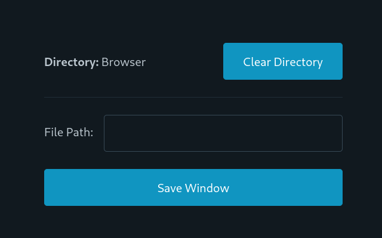

# Obsidian Browser Interface Extension

A chrome extension that pairs with a [obsidian plugin](https://github.com/jason-lieb/obsidian-browser-interface-plugin) to manage your tabs in obsidian.

This extension allows you to save all the tabs in a chrome window in markdown to a folder of your choice. The markdown is designed to be used with the Obsidian Browser Interface Plugin and other Obsidian plugins to display the tabs and reopen or delete them.

### Screenshot

